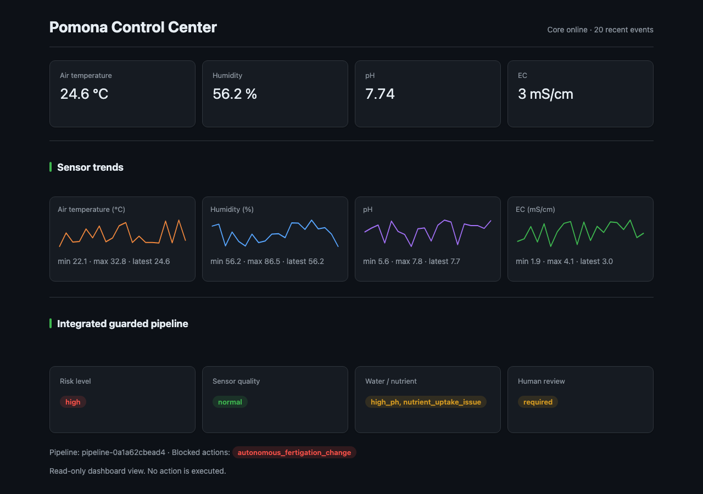

<div align="center">

# 🌱 Pomona

**Open edge AI platform for agriculture** — MQTT ingest, reasoning, deterministic safety checks, and dashboards for the greenhouse.

[](LICENSE)
[](VERSION)
[](CONTRIBUTING.md)
[](https://huggingface.co/Okyanus/ai-pomona-agronomist-gemma4)
[](docs/INSTALL.md)

Anyone can clone, use, fork, and contribute — free under [Apache-2.0](LICENSE).

[Quickstart](#-quickstart-any-os--docker) · [Architecture](#-architecture) · [Model status](#-model-status) · [Phases](#-project-phases) · [Wiki](https://github.com/Okyanus/pomona/wiki) · [Contribute](#-open-source--contribute)



</div>

---

> **Early MVP.** Simulated sensors → SQLite-backed API → guarded reasoner pipeline → read-only dashboard. Docker remains the recommended deployment path; local validation also works without Docker. [What to expect →](docs/GETTING_STARTED.md)

## 🚀 Quickstart (any OS — Docker)

```bash
git clone https://github.com/Okyanus/pomona.git
cd pomona
cp .env.example .env
./scripts/setup.sh          # optional first-time check
./scripts/up.sh
./scripts/sim.sh            # new terminal
curl http://localhost:8080/health
python3 examples/tomato_risk_quickstart.py   # real sensor JSON -> risk labels
```

**Requirements:** [Docker Desktop](https://www.docker.com/products/docker-desktop/)
**Optional:** Python 3.9+ for simulator/tests

| Service | URL |
|---------|-----|
| Core API | http://localhost:8080 |
| Model router | http://localhost:8081 |
| MQTT | localhost:1883 |

Full guide: **[docs/INSTALL.md](docs/INSTALL.md)**
**Target:** one-command full stack (UI + DB in Docker) — [docs/PLUG_AND_PLAY.md](docs/PLUG_AND_PLAY.md)
Local validation details: **[docs/LOCAL_VALIDATION.md](docs/LOCAL_VALIDATION.md)**

### Local validation without Docker

When Docker Desktop is unavailable, run the four-service smoke test with the
local Python environments:

```bash
./scripts/run_local_validation.sh
# or
make local-validation
```

Run the complete local service test suite with:

```bash
make test-local
```

Run tests and the full local service smoke test together with:

```bash
make local-check
```

It uses temporary SQLite and audit state, verifies both high-risk and routine
paths, checks the dedicated Safety Checker, and removes temporary processes and
files when it finishes.

## 🏗 Architecture

```text
Sensor / Simulator → MQTT → pomona-core → DB → model-router
   → reasoner / advisor LLM → safety-checker → automation-engine → dashboard
```

**Hard rule:** the LLM advises — it never directly controls actuators. A deterministic safety-checker is the final authority on any automation action.

More detail: **[docs/architecture.md](docs/architecture.md)**

## 🤝 Open source & contribute

| | |
|---|---|
| **License** | [Apache-2.0](LICENSE) — free to use and modify |
| **Contributing** | [CONTRIBUTING.md](CONTRIBUTING.md) — PRs welcome |
| **Code of conduct** | [CODE_OF_CONDUCT.md](CODE_OF_CONDUCT.md) |
| **Current work** | [docs/PROJECT_STATUS.md](docs/PROJECT_STATUS.md) |
| **Roadmap** | [docs/ROADMAP.md](docs/ROADMAP.md) |
| **Wiki** | [Project wiki →](https://github.com/Okyanus/pomona/wiki) |

**Good first contributions:** dashboard (Phase 2), tests, docs, simulators, crop templates.

Fork → branch → `make test` → open PR.

## 🔗 Related open repos

| Repo | Purpose |
|------|---------|
| **[pomona](https://github.com/Okyanus/pomona)** (this) | Platform — run with Docker |
| [pomona-agronomist-llm](https://github.com/Okyanus/pomona-agronomist-llm) | Agronomist ML training |
| [HF Collection](https://huggingface.co/collections/Okyanus/pomona-local-ai-for-safer-greenhouse-decision-support-6a89931ffcc2f7a3f777f3b9) | All published models + dataset in one place |
| [HF agronomist](https://huggingface.co/Okyanus/ai-pomona-agronomist-gemma4) | Advisor LoRA weights |
| [HF tomato reasoner](https://huggingface.co/Okyanus/pomona-tomato-risk-reasoner-v0.1.7-lora) | Tomato risk-label LoRA (v0.1.7) |
| [HF water/irrigation reasoner](https://huggingface.co/Okyanus/pomona-water-irrigation-risk-reasoner-v0.1.8-lora) | Moisture-risk LoRA release candidate (v0.1.8) |
| [HF actuator command gate](https://huggingface.co/Okyanus/pomona-actuator-command-gate-reasoner-v0.1-lora) | Advisory research preview; deterministic gate remains final |
| [HF greenhouse sensor dataset](https://huggingface.co/datasets/Okyanus/greenhouse-sensor-data) | Published greenhouse sensor dataset |

Model catalog and release status: **[docs/MODEL_CATALOG.md](docs/MODEL_CATALOG.md)**

## 🧠 Model status

Pomona keeps platform code, routing, deterministic safety logic, and metadata in GitHub. Model weights and published datasets live on Hugging Face.

| Model | Current status | Use now? |
|-------|----------------|----------|
| Tomato risk reasoner `v0.1.7` | Published on Hugging Face | ✅ Use |
| Water/irrigation reasoner `v0.1.8` | Published release candidate | ✅ Advisory + deterministic validation |
| Sensor quality reasoner `v0.1.1-boundary` | Local candidate, not published | ✅ Use for integration |
| Safety triage reasoner `v0.1` | Local candidate, not published | ✅ Use for integration |
| Actuator command gate `v0.1` | Published research preview, below standalone release gate | ⚠️ Advisory only; deterministic checker required |
| Actuator command gate `v0.1.1-hardcases` | Regression in local eval | ❌ Do not use |
| Actuator command gate `v0.1.2-correction` | Regression in independent eval | ❌ Do not use |
| Nutrient / pH-EC reasoner `v0.1.1-correction` | LoRA, GGUF, and MLX published | ✅ Use only through deterministic guarded route |

Near-term integration chain:

```text
sensor-quality
  -> tomato-risk
  -> safety-triage
  -> deterministic actuator-command gate
  -> dashboard / human approval
```

Future model families are tracked in [docs/ROADMAP.md](docs/ROADMAP.md) and [docs/SMALL_MODEL_FACTORY.md](docs/SMALL_MODEL_FACTORY.md).

## 📊 Project phases

**Platform `v0.1.0-alpha.1`** · **11 phases** · **2 completed** · **6 active/partial** · **Phase 2 is the primary product focus**

| Phase | Name | Status |
|-------|------|--------|
| 0 | Project setup & open source | ✅ |
| 1 | Local MVP (Docker, core, simulator) | ✅ |
| 2 | Dashboard + database | ⏳ partial — local SQLite, dashboard, audit, Docker, simulation, and backup validation complete; production hardening remains |
| 3 | Tomato reasoner | ⏳ partial — published adapter + guarded API route |
| 4 | Safety checker | ⏳ partial — deterministic tomato/actuator gates |
| 5 | LLM advisor | ⏳ partial — published adapter + router contract |
| 6 | Automation engine | ⬜ |
| 7 | Public demo | ⬜ |
| 8 | ESP32 devices | ⬜ |
| 9 | Model registry | ⏳ partial — public YAML registry + lifecycle metadata |
| 10 | Fine-tune pipeline | ⏳ partial — builders, validators, Colab, clean eval |

Details & update rules: **[docs/PHASES.md](docs/PHASES.md)** · [PROJECT_STATUS.md](docs/PROJECT_STATUS.md) · [VERSIONING.md](docs/VERSIONING.md)

## 📄 License

Copyright 2026 Pomona Contributors. Licensed under [Apache-2.0](LICENSE).
