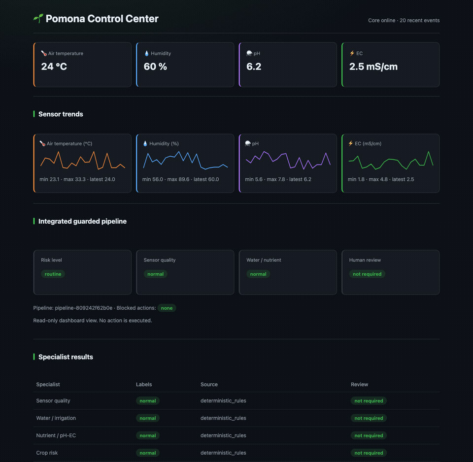

<section class="pomona-hero">
  <div>
    <div class="status">🌱 Early MVP · Apache-2.0 · local first</div>
    <h1>Pomona</h1>
    <p class="tagline">Open edge AI for safer greenhouse and hydroponic decisions.</p>
    <p>Connect simulated or real sensor data to a local pipeline with MQTT, compact reasoners, deterministic safety checks, human-reviewed suggestions, and an operational dashboard.</p>
    <div class="actions">
      <a class="pomona-button primary" href="https://huggingface.co/spaces/Okyanus/pomona-greenhouse-demo">Try the browser demo</a>
      <a class="pomona-button" href="GETTING_STARTED/">Run Pomona locally</a>
      <a class="pomona-button" href="https://github.com/okyanu/pomona">View on GitHub</a>
    </div>
  </div>
  
</section>

## From sensor reading to guarded suggestion

```text
Sensor / Simulator → MQTT → Pomona Core → SQLite → Model Router
  → specialist reasoners → Safety Checker → Automation Engine → Dashboard
```

<p class="safety-rule"><strong>Safety boundary:</strong> the LLM advises; it never directly controls actuators. Deterministic checks and human approval remain in the control path.</p>

## Explore Pomona

<div class="grid cards" markdown>

-   :material-play-circle-outline:{ .lg .middle } **Try without installing**

    ---

    Test guarded tomato, irrigation, and nutrient scenarios in the public browser demo.

    [:octicons-arrow-right-24: Open the demo](https://huggingface.co/spaces/Okyanus/pomona-greenhouse-demo)

-   :material-docker:{ .lg .middle } **Run the local stack**

    ---

    Start MQTT, the APIs, safety services, automation suggestions, and the dashboard with Docker Compose.

    [:octicons-arrow-right-24: Read the quickstart](GETTING_STARTED.md)

-   :material-shield-check-outline:{ .lg .middle } **Understand the safety design**

    ---

    See how model output is constrained by schemas, deterministic rules, and explicit approval.

    [:octicons-arrow-right-24: Explore the architecture](architecture.md)

-   :material-brain:{ .lg .middle } **Use specialist reasoners**

    ---

    Browse Pomona's small-model catalog and the lifecycle status of each published or local candidate.

    [:octicons-arrow-right-24: Browse the model catalog](MODEL_CATALOG.md)

</div>

## What works today

| Capability | Current state |
|---|---|
| Sensor ingestion | MQTT and REST ingestion with SQLite persistence |
| Dashboard | Read-only sensor, guarded-pipeline, audit, and service views |
| Reasoning | Deterministic rules plus guarded local-model routes |
| Safety | Dedicated deterministic safety checker and actuator-command gate |
| Automation | YAML rules produce suggestions with manual approve/reject decisions |
| Public demo | Static Hugging Face Space with preset greenhouse scenarios |

Pomona is an **early MVP**, intended for development and evaluation—not unattended production control. See the [current project status](PROJECT_STATUS.md) for verified capabilities and remaining work.

## Start in five minutes

```bash
git clone https://github.com/okyanu/pomona.git
cd pomona
cp .env.example .env
./scripts/up.sh
```

In a second terminal:

```bash
./scripts/sim.sh
```

[Read the complete installation guide](INSTALL.md){ .md-button }

## Models and data

Model weights and published datasets stay on Hugging Face; platform code, schemas, routing, and deterministic safety logic stay on GitHub.

- [Pomona model and dataset collection](https://huggingface.co/collections/Okyanus/pomona-local-ai-for-safer-greenhouse-decision-support-6a89931ffcc2f7a3f777f3b9)
- [Tomato risk reasoner](https://huggingface.co/Okyanus/pomona-tomato-risk-reasoner-v0.1.7-lora)
- [Water and irrigation reasoner](https://huggingface.co/Okyanus/pomona-water-irrigation-risk-reasoner-v0.1.8-lora)
- [Greenhouse sensor dataset](https://huggingface.co/datasets/Okyanus/greenhouse-sensor-data)

## Help build the open agriculture stack

Pomona welcomes focused contributions to documentation, tests, dashboards, simulators, device integrations, and guarded reasoning. Start with the [project status](PROJECT_STATUS.md), then choose a small issue or open a discussion.

[Contribution guide](https://github.com/okyanu/pomona/blob/main/CONTRIBUTING.md){ .md-button .md-button--primary }
[Open issues](https://github.com/okyanu/pomona/issues){ .md-button }
[Start a discussion](https://github.com/okyanu/pomona/discussions){ .md-button }
